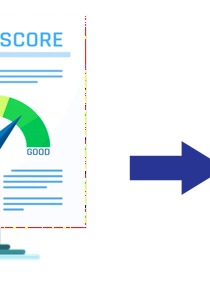

```{r share-again, echo=FALSE}
options(htmltools.dir.version = FALSE, htmltools.preserve.raw = FALSE)
#xaringanExtra::use_share_again()
xaringanExtra::use_fit_screen()
```


class: clear, inverse, mline, center, middle

# Motivación

---

layout: true

<div class="footer"><span> 
  <div class="row">
  <div class="content1"> Jaime Andrés Suquillo Llumiquinga - EPN </div> 
  <div class="content1"> Proyecto de Investigación </div> 
  <div class="content1"> Diciembre 17, 2021 </div> 
  </div>
</span></div>      


---

class: slides-demo

# Motivación


--

* Concesión de Crédito

--
* Riesgo de Crédito

--
* Sistema Financiero

--
<br>

<div class="definition_box2" style="margin-top:70px;">
<div class="txt1"> 
[Aguilar y Camargo, 2004] al respecto señalan: “un elevado número de créditos en condición no pago constituyen una de las principales causas de la insolvencia y descapitalización; lo que finalmente atenta contra la solidez y sostenimiento de la institución en el largo plazo”.
</div>
</div>


---

class: slides-demo

# Motivación



--

* Sistema Financiero

--
* Calificación Crediticia

--
* Credit Scoring 

--
<br>

<div class="definition_box2" style="margin-top:60px;">
<div class="txt1"> 
El credit scoring es un sistema de evaluación crediticia que permite valorar de forma
automática el riesgo asociado a cada solicitud de crédito. Es capaz de predecir la probabilidad
de no pago de los clientes y las pérdidas en caso de incumplimiento [Elizondo, 2003].
</div>
</div>


