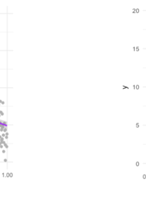
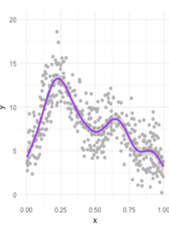

```{r share-again, echo=FALSE}
options(htmltools.dir.version = FALSE, htmltools.preserve.raw = FALSE)
#xaringanExtra::use_share_again()
xaringanExtra::use_fit_screen()
```


class: clear, inverse, mline, center, middle

# Planteamiento del Problema

---

layout: true

<div class="footer"><span> 
  <div class="row">
  <div class="content1"> Jaime Andrés Suquillo Llumiquinga - EPN </div> 
  <div class="content1"> Proyecto de Investigación </div> 
  <div class="content1"> Diciembre 17, 2021 </div> 
  </div>
</span></div>      


---

class: slides-demo

# Planteamiento del Problema




<div class="definition_box2" style="margin-top:365px;">
<div class="txt1"> 
La regresión logística es el modelo estadístico más utilizado en la industria de calificación crediticia. A pesar de sus ventajas en la fácil interpretación y el bajo costo computacional, la regresión logística está bajo la crítica de la dificultad de modelar las características no lineales, del efecto de los predictores sobre la variable dependiente y, por lo tanto, podría dar lugar a resultados insatisfactorios.
</div>
</div>

--


--


---

class: slides-demo

# Planteamiento del Problema




<div class="definition_box2" style="margin-top:365px;">
<div class="txt1"> 
Los Modelos Aditivos Generalizados introducidos por [Hastie and Tibshirani, 1990] proporcionan la capacidad de detectar los patrones no lineales sin sacrificar la interpretabilidad. Una generalización del modelo logístico (logit) es el <b> Modelo Logístico Aditivo Generalizado </b> empleado cuando los valores de variable dependiente son binarios.
</div>
</div>


--


