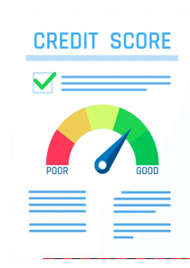

```{r share-again, echo=FALSE}
options(htmltools.dir.version = FALSE, htmltools.preserve.raw = FALSE)
#xaringanExtra::use_share_again()
xaringanExtra::use_fit_screen()
```


class: clear, inverse, mline, center, middle

# Datos

---

layout: true

<div class="footer"><span> 
  <div class="row">
  <div class="content1"> Jaime Andrés Suquillo Llumiquinga - EPN </div> 
  <div class="content1"> Proyecto de Investigación </div> 
  <div class="content1"> Diciembre 17, 2021 </div> 
  </div>
</span></div>      


---

class: slides-demo

# Datos

<h3 style = "margin-top: 35px; margin-bottom: -5px" > Descripción de la Base de datos </h3>


--
- 127,413 Observaciones.

--
- 61 Variables explicativas.

--
- Junio de 2016 - Julio de 2017.

--

<h4 style = "margin-top: 20px; margin-bottom: -10px" > <b>Variable dependiente</b> </h4> 

--

$$Calificación =\begin{cases} 1: \textrm{Si el cliente es definido como BUENO} \\ 0: \textrm{Si el cliente es definido como MALO} \end{cases}$$

--

<h4 style = "margin-top: -5px; margin-bottom: 0px" > <b>Variables Independientes</b> </h4> 

--
<div class="txt1" style = "margin-top: 15px; margin-bottom: 15px"> 
La información proviene de tres distintas fuentes:
</div>

--
.pull-left[
* Información sociodemográfica.


]


--
.pull-right[

* Información interna.
* Información externa.


]


