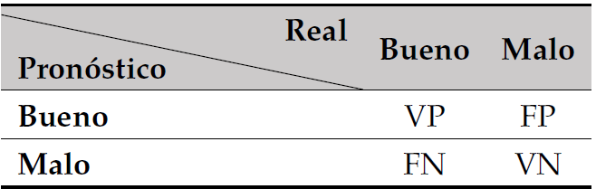
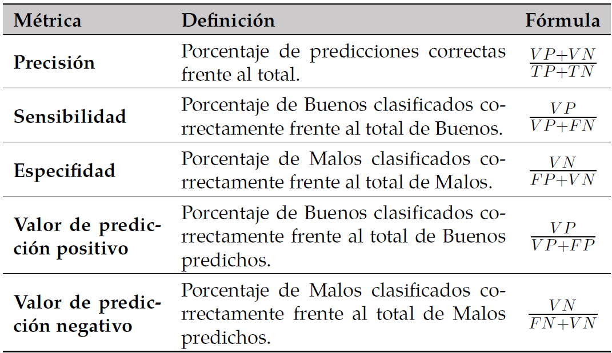
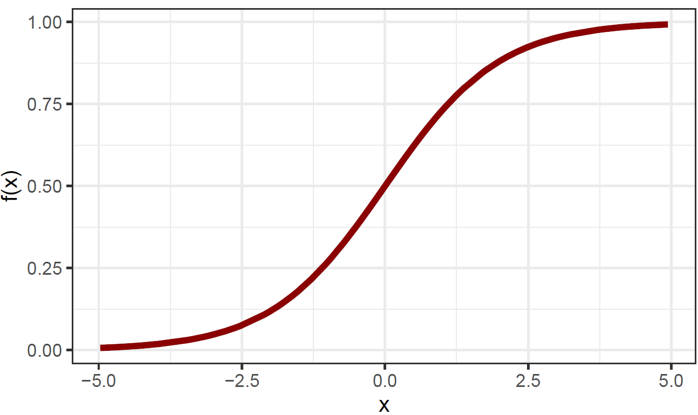
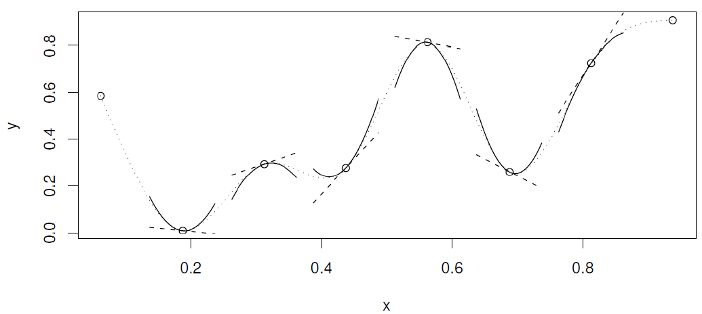

```{r share-again, echo=FALSE}
options(htmltools.dir.version = FALSE, htmltools.preserve.raw = FALSE)
#xaringanExtra::use_share_again()
xaringanExtra::use_fit_screen()
```


class: clear, inverse, mline, center, middle

# Metodología

---

layout: true

<div class="footer"><span> 
  <div class="row">
  <div class="content1"> Jaime Andrés Suquillo Llumiquinga - EPN </div> 
  <div class="content1"> Proyecto de Investigación </div> 
  <div class="content1"> Diciembre 17, 2021 </div> 
  </div>
</span></div>      

<style>
.mjx-mrow a {
  color: black;
  pointer-events: none;
  cursor: default;
}
</style>

---

class: slides-demo


# Naturaleza de los modelos 
<br>
<div class="txt1" style = "margin-top: 5px; margin-bottom: -5px"> 
Un modelo <i>Credit Score</i> se puede aplicar según la etapa del ciclo de vida de un crédito. 
</div>

--
* Scoring de originación

--
* Scoring de comportamiento

--

Los modelos que son objeto de estudio tienen como objetivo principal estimar la probabilidad
de incumplimiento de un cliente que cuenta con historial crediticio.

--

$$Y =\begin{cases} 1: \textrm{Si el cliente es definido como BUENO} \\ 0: \textrm{Si el cliente es definido como MALO} \end{cases}$$

--
Los modelos propuestos buscan estimar la probabilidad de que la variable $Y$ tome valores en el conjunto $\{0, 1\}$, a partir del conjunto de las variables independientes.

---

class: slides-demo

# Estadísticos

--
<div class="definition_box1" style="margin-top:30px; margin-bottom:20px;">
    <div class="childA">
    Estadístico de Kolmogorov – Smirnov (KS) para dos muestras
    </div>
    <div class="childB">
    Es una prueba de bondad de ajuste del tipo no paramétrico que contrasta la siguiente hipótesis: dos muestras aleatorias provienen de distribuciones continuas idénticas.
    </div>
</div>

--
<div class="txt1" style = "margin-bottom: -10px"> 
Consideremos:
</div>

--
* ${ x }_{ 1 },{ x }_{ 2 },...,{ x }_{ { N }_{ 1 } }$, muestra aleatoria de tamaño ${ N }_{ 1 }$ de una variable aleatoria continua $X$ con función de distribución ${ F }_{ 1 }$.  

--
* ${ y }_{ 1 },{ y }_{ 2 },...,{ y }_{ { N }_{ 2 } }$, muestra aleatoria de tamaño ${ N }_{ 2 }$ de una variable aleatoria continua $Y$ con función de distribución ${ F }_{ 2 }$. 

--

<div class="txt1" style = "margin-top: 20px; margin-bottom: -10px"> 
Con lo cual, se contrastan las siguientes hipótesis:
</div>
$$\begin{cases} { H }_{ 0 }: { F }_{ 1 }\left( x \right) ={ F }_{ 2 }\left( x \right) \quad \forall x \\ { H }_{ 1 }:{ F }_{ 1 }\left( x \right) \neq { F }_{ 2 }\left( x \right)  \end{cases}$$

--
<script async="true" src="https://cdn.jsdelivr.net/npm/mathjax@2/MathJax.js?config=TeX-MML-AM_CHTML"> </script>

<div class="txt1" style = "margin-top: -15px; margin-bottom: -20px"> 
El estadístico de prueba $KS$ utilizado para rechazar o no la hipótesis nula $\left(H_{0}\right)$ viene dado por:
</div>
$$KS={ max }_{ x }\left| { ecdf }_{ 1 }\left( x \right) -ecdf_{ 2 }\left( x \right)  \right|$$

---

class: slides-demo

# Estadísticos

--
<div class="definition_box1" style="margin-top:30px; margin-bottom:18px;">
    <div class="childA">
    Valor de información `(VI)`
    </div>
    <div class="childB">
    El valor de información de una variable categórica en problemas de clasificación binaria (Bueno/Malo), según [Finlay, 2010], es probablemente la medida de asociación más popular que permite cuantificar el poder predictivo de una variable para decidir que tan bien discrimina las clases de la variable dependiente.
    </div>
</div>

--
<div class="txt1" style = "margin-bottom: -10px"> 
El valor de información para una variable categórica se calcula como:
</div>

$$VI =\sum _{ i=1 }^{ n }{ \left( \frac { { b }_{ i } }{ B } -\frac { { m }_{ i } }{ M }  \right) \cdot \ln { \left( \frac { { b }_{ i } \cdot { M } }{ B \cdot { m }_{ i } }  \right)  }  }$$
--
<div class="txt1" style = "margin-top: -15px; margin-bottom: -10px"> 
donde:
</div>

--
* $\boldsymbol{n:}$ Número de categorías en que se ha clasificado la variable categórica.  

--
* $\boldsymbol{{ b }_{ i }:}$ Número de elementos etiquetados como bueno dentro de la categoría $i$. 

--
* $\boldsymbol{{ m }_{ i }:}$ Número de elementos etiquetados como malo dentro de la categoría $i$. 

--
* $\boldsymbol{B:}$ Número total de elementos etiquetados como bueno.

--
* $\boldsymbol{M:}$ Número total de elementos etiquetados como malo.
 
---

class: slides-demo

# Estadísticos

--
<div class="definition_box1" style="margin-top:40px; margin-bottom:30px;">
    <div class="childA">
    Factor de inflación de la varianza generalizado `(GVIF)`
    </div>
    <div class="childB">
    Indica el grado en el que la varianza del coeficiente `B_{ i }`  de una variable explicativa aumenta debido a la correlación de esta variable
con las demás variables explicativas del modelo.
    </div>
</div>

--
<div class="txt1" style = "margin-bottom: -5px"> 
Se define como:
</div>

$${GVIF}_{i}=\frac{det{R}_{i} \cdot det{R}_{-i}}{det{R}}$$
--
<div class="txt1" style = "margin-top: -5px; margin-bottom: 0px"> 
donde:
</div>

--
* $det{R}_{i}:$ determinante de la matriz de correlación para la variable $i$.

--
* $det{R}_{-i}:$ determinante de la matriz de correlación para el resto de variables del modelo.

--
* $det{R}:$ determinante de la matriz de correlación completa.

---

class: slides-demo

# Estadísticos

--
<div class="definition_box1" style="margin-top:40px; margin-bottom:30px;">
    <div class="childA">
    Área bajo la curva ROC
    </div>
    <div class="childB">
    La Curva ROC (Característica Operativa del Receptor) es una representación gráfica de
probabilidad que muestra el rendimiento de un modelo de clasificación evaluando la capacidad que tiene para discriminar entre Buenos y Malos. 
    </div>
</div>

--
<div class="txt1" style = "margin-bottom: 0px"> 
Esta gráfica es representada mediante la relación entre:
</div>


--
* **Sensibilidad:** Razón de verdaderos positivos. Es decir, clientes Buenos que fueron
clasificados como Buenos en el modelo.

--
* **Especificidad:** Razón de falsos positivos. Es decir, clientes Malos que el modelo
clasificó como clientes Buenos.

--

<div class="definition_box2" style="margin-top:25px;">
<div class="txt1">
AUC (Área bajo la curva ROC) mide el rendimiento de un modelo de clasificación. El valor AUC debe estar sobre 0,5 y para modelos de clasificación, se consideran adecuados valores que sean superiores a 0,7 [Siddiqi, 2006].
</div>
</div>

---

class: slides-demo

# Estadísticos

--
<div class="definition_box1" style="margin-top:30px; margin-bottom:15px;">
    <div class="childA">
    Coeficiente de GINI
    </div>
    <div class="childB">
Es una métrica de precisión empleada para medir que tan bien
un modelo <i>credit scoring</i> logra distinguir a clientes Buenos y Malos cuando el punto de corte varía a lo largo del rango de la probabilidad pronostocada. Indica el poder predictivo del modelo.
    </div>
</div>

--
<div class="txt1" style = "margin-bottom: -15px"> 
Se lo calcula mediante la siguiente expresión:
</div>

$$GINI = 1-\sum_{i=1}^{n}{\left [ P_{b}\left(i+1\right)-P_{b}\left(i\right) \right ] \left [ P_{m}\left(i+1\right)+P_{m}\left(i\right) \right ]}$$
--
<div class="txt1" style = "margin-top: -18px; margin-bottom: -10px"> 
donde:
</div>

--
* $\boldsymbol{n:}$  Número de intervalos.

--
* $\boldsymbol{P_{b}:}$  Proporción de buenos hasta el intervalo $i$.

--
* $\boldsymbol{P_{m}:}$ Proporción de malos hasta el intervalo $i$.


--

<div class="definition_box2" style="margin-top:17px;">
<div class="txt1">
Se considera que para modelos de comportamiento, es posible obtener un coeficiente de Gini de más del `80%`, mientras que un valor por debajo del `60%` podría generar sospechas [Anderson, 2007].
</div>
</div>

---

class: slides-demo

# Estadísticos

--
<div class="definition_box1" style="margin-top:40px; margin-bottom:25px;">
    <div class="childA">
    Matriz de confusión
    </div>
    <div class="childB">
Es una herramienta que permite evaluar la precisión y exactitud de un modelo de clasificación. Compara los valores reales con los valores pronosticados por el modelo para la variable objetivo.
    </div>
</div>

--
<div class="txt1" style = "margin-bottom: -10px"> 
Para una matriz de un problema de clasificación binaria:
</div>



--
* **Verdadero Positivo (VP):** Si un cliente Bueno es clasificado como Bueno.

--
* **Falso Negativo (FN):** Si un cliente Bueno es clasificado como Malo.

--
* **Falso Positivo (FP):** Si un cliente Malo es clasificado como Bueno. 

--
* **Verdadero Negativo (VN):** Si un cliente Malo es clasificado como Malo. 

---

class: slides-demo

# Estadísticos

<div class="txt1" style = "margin-top: 40px; margin-bottom: 40px"> 
Se definen las siguientes métricas de desempeño asociadas más importantes:
</div>

--



---

class: slides-demo

# Estadísticos

<div class="definition_box1" style="margin-top:40px; margin-bottom:20px;">
    <div class="childA">
    Tablas de desempeño
    </div>
    <div class="childB">
Permite visualizar la calidad de discriminación que realiza el modelo por cada intervalo. En general la probabilidad estimada se divide en 10 intervalos.
    </div>
</div>

--
<div class="txt1" style = "margin-bottom: 0px"> 
La estructura de una tabla de desempeño, se divide en las siguientes secciones:
</div>

--
* **Probabilidad Buen Pagador:** Se divide en diez intervalos (abierto a la izquierda y cerrado a la derecha).

--
* **Clientes Totales:** Número total de clientes, porcentaje de clientes y porcentaje acumulado.

--
* **Clientes Buenos::** Número de clientes Buenos, porcentaje de clientes Buenos y el porcentaje acumulado de clientes Buenos.

--
* **Clientes Malos:** Número de clientes Malos, porcentaje de clientes Malos y el porcentaje acumulado de clientes Malos.

--
* **Tasa: Buenos / Malos::** Porcentaje de clientes Buenos y Malos respecto al total de clientes por cada intervalo de probabilidad.

---

class: slides-demo

# Estadísticos


<div class="txt1" style = "margin-top: 40px; margin-bottom: 30px"> 
Un modelo credit scoring presenta un buen desempeño cuando:
</div>

--
* El porcentaje de clientes **Buenos** por cada intervalo crece cuando la probabilidad aumenta, mientras que el porcentaje de clientes **Malos** por cada intervalo decrece cuando la probabilidad aumenta.

--
* En los deciles más altos se concentran porcentajes significativos de clientes Buenos.

---

class: slides-demo

# Modelo de regresión logística - logit

<h3 style = "margin-bottom: -10px" > Introducción </h3>  

--
La modelación estadística permite explicar la relación entre una **variable dependiente** $Y$, y un conjunto de $p$ **variables independientes** ${ X }_{ 1 },{ X }_{ 2 },\dots ,{ X }_{ p }$. Esta relación puede expresarse formalmente como:

--
\begin{align}
Y&=f\left( { X }_{ 1 },{ X }_{ 2 },\dots ,{ X }_{ p } \right)+\epsilon,\tag{1}
\end{align}

donde: 

--
* $f:$ Función desconocida fija de ${ X }_{ 1 },{ X }_{ 2 },\dots ,{ X }_{ p }$. 

--
* $\epsilon:$ Término de error aleatorio.

--

<div class="txt1" style = "margin-top: 20px; margin-bottom: 0px"> 
Con ayuda de determinados métodos o modelos de aprendizaje estadístico se estima una función `f` que satisfaga la igualdad `(1)`.
</div>

--

<div class="txt1" style = "margin-top: 20px; margin-bottom: 0px"> 
La mayoría de estos modelos pueden clasificarse como: <b>modelos paramétricos</b> y <b>modelos no paramétricos</b>.
</div>

---

class: slides-demo

# Modelo de regresión logística - logit

<h3 style = "margin-bottom: 0px" > Modelos paramétricos </h3>  

--
<div class="txt1" style = "margin-top: 15px; margin-bottom: 20px"> 
La función `f` tiene una forma funcional específica. Se estiman con un enfoque basado en modelos de dos pasos:
</div>


--
* Se realiza un supuesto sobre la forma funcional de $f$. Por ejemplo, si $f$ es lineal se lo expresa de la siguiente forma:

\begin{align}
    f\left( X \right) &={ \beta  }_{ 0 }+{ \beta  }_{ 1 }{ X }_{ 1 }+{ \beta  }_{ 2 }{ X }_{ 2 }+\dots +{ \beta  }_{ p }{ X }_{ p }\tag{2}
\end{align}

--
* Para el ajuste del modelo lineal $\left(2\right)$, se necesita estimar los valores de los $p+1$ parámetros ${ \beta  }_{ 0 },{ \beta  }_{ 1 },\dots ,{ \beta  }_{ p }$ de modo que

\begin{align}
    Y &\approx { \beta  }_{ 0 }+{ \beta  }_{ 1 }{ X }_{ 1 }+{ \beta  }_{ 2 }{ X }_{ 2 }+\dots +{ \beta  }_{ p }{ X }_{ p }\tag{3}
\end{align}

--
El **Modelo Lineal Generalizado** generaliza el modelo lineal clásico, de manera que la variable dependiente $Y$ está relacionada linealmente con las covariables mediante una determinada función de enlace (Función Link). Estos modelos forman parte del enfoque paramétrico en incluyen el **Modelo de regresión logística múltiple**.

---

class: slides-demo

# Modelo de regresión logística - logit

<div class="txt1" style = "margin-top: 30px; margin-bottom: 10px"> 
Método paramétrico que se utiliza para predecir la probabilidad de una variable dependiente categórica, en nuestro caso binaria: Bueno `(1)` y Malo `(0)`.
</div>

--

<div class="txt1" style = "margin-top: 0px; margin-bottom: 3px"> 
Consideremos:  
</div>

--
* $n:$ Número de individuos en una muestra aleatoria.

--
* $p:$ Número de varibles explicativas o independientes.

--
* $X=\left( X_{ 1 },X_{ 2 },...,{ X }_{ p } \right):$ Conjunto de $p$ variables independientes.

--
* $X_{ i }=\left(1, { x }_{ i1 }, { x }_{ i2 },\dots { x }_{ ip } \right):$ Vector de características del individuo $i$, donde ${ x }_{ ij }$ es el valor de la variable $j=1,2,\dots ,p$ en el individuo $i=1,2,\dots ,n$.

--
* $Y=\left( y_{ 1 },y_{ 2 },...,y_{ n } \right):$ La variable dependiente, donde ${ y }_{ i }$ es el valor de la variable $Y$ en el individuo $i$. El valor ${ y }_{ i }$, representa lo siguiente: 

$$y_i =\begin{cases} 1: \textrm{Si el individuo i es etiquetado como Bueno} \\ 0: \textrm{Si el individuo i es etiquetado como Malo.} \end{cases}\tag{4}$$

--
* $\beta =\left( { \beta  }_{ 0 },{ \beta  }_{ 1 },{ \beta  }_{ 2 },\dots ,{ \beta  }_{ p } \right) :$ Vector de $p+1$ parámetros (constantes) desconocidos que permitirán relacionar las variables independientes $X$, con la variable dependiente $Y$.

---

class: slides-demo

# Modelo de regresión logística - logit

<div class="txt1" style = "margin-top: 35px; margin-bottom: 15px"> 
La función de distribución logística es base del modelo logit, está definida de la siguiente manera: </div>

--
\begin{align}
    { \pi  }_{ i }&=Pr\left( { y }_{ i }=1|{ X }_{ i } \right) =\frac { 1 }{ 1+exp\left( -{ \tau  }_{ i } \right)  } ,\quad -\infty <{ \tau  }_{ i }<\infty ,\quad i=1,2,\dots, n\tag{5}    
\end{align}

--
con,

--
\begin{align*}
    { \tau  }_{ i }&={ { X } }_{ i }^{ T }\beta ={ \beta  }_{ 0 }+{ \beta  }_{ 1 }{ x }_{ i1 }+{ \beta  }_{ 2 }{ x }_{ i2 }+\dots +{ \beta  }_{ p }{ x }_{ ip }.
\end{align*}

Donde:

--
* ${ \pi  }_{ i }:$ Función permite encontrar la probabilidad de que ${ y }_{ i }=1$, el individuo $i$ sea etiquetado como $Bueno$, tomando en cuenta las características ${ X }_{ i }$ que posee. El rango de esta función está en el intervalo $\left[ 0,1 \right]$

--

El modelo tiene como objetivo estimar los coeficientes ${ \beta  }_{ 0 },{ \beta  }_{ 1 },\dots ,{ \beta  }_{ p }$ que mejor se ajusten a la ecuación $\left(5\right)$.

---

class: slides-demo

# Modelo de regresión logística - logit

<div class="txt1" style = "margin-top: 35px; margin-bottom: 0px"> 
Despejando `{ \tau  }_{ i }` de `(5)` se obtiene la igualdad conocida como modelo `logit`.
</div>

--

\begin{align}
   { \tau  }_{ i }= logit\left( { \pi  }_{ i } \right) =\ln { \left( \frac { { \pi  }_{ i } }{ 1-{ \pi  }_{ i } }  \right)  } ={ \beta  }_{ 0 }+{ \beta  }_{ 1 }{ x }_{ i1 }+{ \beta  }_{ 2 }{ x }_{ i2 }+\dots +{ \beta  }_{ p }{ x }_{ ip }\tag{6}
\end{align}

--

<div class="txt1" style = "margin-top: -5px; margin-bottom: 10px"> 
A la ecuación `(6)` se la conoce como razón de probabilidades `(odds` `ratio)`. La función <i>logística</i> puede ser representada gráficamente:
</div>


--
<figure style = "margin-top: 0px; margin-bottom: 0px">
<figcaption style="text-align: center;">Fig.1 - Función logística.</figcaption>
  
</figure>

---

class: slides-demo

# Modelo de regresión logística - logit

<h3 style = "margin-bottom: 0px" > Interpretación de los parámetros `\beta` </h3>  

<div class="txt1" style = "margin-top: 15px; margin-bottom: 0px"> 
La ventaja que posee un modelo <i>logit</i> se encuentra en su fácil interpretación. Para ayudar en la interpretación de los coeficientes es necesario conocer el significado de `odds`.
</div>

--

<div class="definition_box2" style="margin-top:20px;">
<div class="txt1">
Se define como la razón que se establece entre la probabilidad de ocurrencia de un suceso y la probabilidad de no ocurrencia del mismo.
</div>
</div>

--
<div class="txt1" style = "margin-top: 20px; margin-bottom: 0px"> 
La relación que existe entre el `Odds` y la probabilidad es:
</div>

--

\begin{align}
    Odds=\frac {Probabilidad~de~que~un~suceso~ocurra}{Probabilidad~de~que~un~suceso~no~ocurra}\tag{7}
\end{align}

--
<div class="txt1" style = "margin-top: 15px; margin-bottom: 10px"> 
Si tomamos en cuenta la ecuación `(5)` y la relacionamos con la ecuación `(7)` se obtiene:
</div>

--

\begin{align}
    \frac { { \pi  }_{ i } }{ 1-{ \pi  }_{ i } } =\frac { \frac { 1 }{ 1+exp\left( -{ \tau  }_{ i } \right)  }  }{ \frac { exp\left( -{ \tau  }_{ i } \right)  }{ 1+exp\left( -{ \tau  }_{ i } \right)  }  } =exp\left( { \tau  }_{ i } \right) \tag{8}
\end{align}

---

class: slides-demo

# Modelo de regresión logística - logit

<div class="txt1" style = "margin-top: 35px; margin-bottom: 20px"> 
Este resultado se conoce como transformación <i>logit</i> de la probabilidad `{ \pi  }_{ i }`  y la relación `\frac { { \pi  }_{ i } }{ 1-{ \pi  }_{ i } }` como razón de probabilidades (`Odds~ratio`). Si tomamos el logaritmo natural de `(8)` y se reemplaza `{ \tau  }_{ i }={ { X } }_{ i }^{ T }\beta`, se obtiene como resultado la ecuación `(7)`:
</div>

--

\begin{align}
    logit\left( { \pi  }_{ i } \right) =\ln { \left( \frac { { \pi  }_{ i } }{ 1-{ \pi  }_{ i } }  \right)  } ={ { X } }_{ i }^{ T }\beta={ \beta  }_{ 0 }+{ \beta  }_{ 1 }{ x }_{ i1 }+{ \beta  }_{ 2 }{ x }_{ i2 }+\dots +{ \beta  }_{ p }{ x }_{ ip } \tag{9}
\end{align}

--
<div class="definition_box2" style = "margin-top: 25px; margin-bottom: 10px">
<div class="txt1">
El `Odds~ratio` interpreta el modelo como el cambio estimado del logaritmo natural de las probabilidades en favor de la variable dependiente cuando cada una de las variables independientes cambia en una unidad.
</div>
</div>


--
<div class="txt1" style = "margin-top: 20px; margin-bottom: 15px"> 
La interpretación del `Odds~ratio`, según [Gujarati] es la siguiente:
</div>

* $Odds~ratio > 1:$ Significa  que existe una relación positiva (o directa).
* $Odds~ratio < 1:$ Significa  que existe una relación negativa (o inversa).
* $Odds~ratio = 1:$ Significa  que no existe una relación.

---

class: slides-demo

# Modelo logístico aditivo generalizado

<h3 style = "margin-bottom: 0px" > Modelos no paramétricos </h3>  

<div class="txt1" style = "margin-top: 25px; margin-bottom: 10px"> 
La función `f` no realiza suposición alguna sobre la forma funcional de la misma.
</div>

--

* Ofrece mucha más flexibilidad que los modelos paramétricos.

--
* Se pueden usar funciones suaves en la búsqueda de la función $f$.

--
* El riesgo que se asume con estos modelos, es el fenómeno conocido como sobreajuste.

--
* Pueden conducir a estimaciones muy complejas de $f$.

--

<div class="txt1" style = "margin-top: 25px; margin-bottom: 0px"> 
El <b>Modelo Aditivo Generalizado</b> ofrece un punto medio:
</div>

--
* Se adapta a relaciones complejas y no lineales.

--
* Mantiene la aditividad, haciendo uso de elementos paramétricos y no paramétricos.

--
* Hace buenas predicciones y permite hacer estadísticas inferenciales.

--
* Se comprende y se puede explicar la estructura subyacente de los modelos y el porqué de las predicciones que hacen. 


---

class: slides-demo

# Modelo logístico aditivo generalizado

<div class="definition_box2" style = "margin-top: 35px; margin-bottom: 15px">
<div class="txt1">
El <b>Modelo Aditivo Generalizado</b>, presentado por Hastie y Tibshirani (1986,1990), es una extensión de los Modelos Lineales Generalizados (GLM) al permitir funciones no lineales en cada una de las variables explicativas, mientras se mantiene la aditividad.
</div>
</div>

--
<div class="txt1" style = "margin-top: 15px; margin-bottom: 0px"> 
La estructura del modelo toma la siguiente forma:
</div>

\begin{align}
    g\left( { u }_{ i } \right) ={ { { X } }_{ i }^{ { \ast  } } }\theta +{ f }_{ 1 }\left( { x }_{ i1 } \right) +{ f }_{ 2 }\left( { x }_{ i2 } \right) +{ f }_{ 3 }\left( { x }_{ i3 } \right) +\dots +{ \epsilon  }_{ i } \tag{10}
\end{align}

<div class="txt1" style = "margin-top: 0px; margin-bottom: 0px"> 
donde:
</div>

--
* ${ u }_{ i }\equiv \mathbb{E}\left( { Y }_{ i } \right)$ con ${ Y }_{ i }\sim$ alguna distribución de la Familia Exponencial.

--
* $g\left(  \right)$ es la función de enlace.

--
* ${ { X } }_{ i }^{ { \ast  } }$ es la $i-\acute{e}sima$ fila de la matriz del modelo correspondiente a las variables explicativas estrictamente paramétricas.

--
* $\theta$ es el vector de coeficientes correspondiente.

--
* ${ f }_{ j }$ son las funciones suaves (funciones que tienen derivadas continuas hasta cierto orden) de las variables que se modelan no paramétricamente.

---

class: slides-demo

# Modelo logístico aditivo generalizado

<div class="txt1" style = "margin-top: 35px; margin-bottom: 0px"> 
Esta flexibilidad lleva consigo dos necesidades:
</div>

--

* Cómo representar las funciones suaves.

--
* Cómo suavizar estas funciones.

--

<div class="txt1" style = "margin-top: 25px; margin-bottom: 0px"> 
Algunos de los métodos de suavizamiento son: 
</div>

--

**Splines de suavizado, splines de regresión, etc.**

--
* Se pueden expresar utilizando expansiones de base. 

--
* La estimación con splines de regresión se realiza mediante PIRLS (mínimos cuadrados reponderados iterativamente penalizados).

--

**Suavizamiento por núcleos (Kernel Smoothing) y regresión polinomial local (LOESS)**

--
* No se pueden expresar mediante la expansión de base.

--
* La estimación, se realiza mediante el algoritmo backfitting (Breiman y Friedman, 1985).

---

class: slides-demo

# Modelo logístico aditivo generalizado

<h3 style = "margin-bottom: 0px" > Suavizado Univariante - Funciones de Base </h3>  

--
<div class="txt1" style = "margin-top: 25px; margin-bottom: 0px"> 
La ecuación `(10)` simplificada a una función suave como regresor es igual a:
</div>

--

\begin{align}
    { y }_{ i }=f\left( x_{ i } \right) +{ \epsilon  }_{ i },\quad i=1,2,\dots ,n \tag{11}
\end{align}

<div class="txt1" style = "margin-top: 10px; margin-bottom: 10px"> 
donde:
</div>

--

* ${ y }_{ i }:$ Variable dependiente.

--
* $x_{ i }:$ Variable explicativa (regresor).

--
* $f:$ Una función suave.

--
* ${ \epsilon  }_{ i }:$ Error aleatorio idénticamente distribuido con distribución $N\left( 0,{ \sigma  }^{ 2 } \right)$.

--

<div class="txt1" style = "margin-top: 15px; margin-bottom: 0px"> 
Para convertir la ecuación `(11)` en un modelo lineal, es necesario es coger una base. Para lo cual, se define:
</div>

--

* ${ b }_{ j }:$ Espacio de **funciones base** de dimensión $q+1$ en donde $f$ (o una buena aproximación), esté presente.


---

class: slides-demo

# Modelo logístico aditivo generalizado

<h3 style = "margin-bottom: 0px" > Suavizado Univariante - Funciones de Base </h3>  

--
<div class="txt1" style = "margin-top: 25px; margin-bottom: 0px"> 
[Wood, Simon N., 2017], define esta base mediante una combinación lineal entre algunas <b>funciones básicas</b> conocidas y un vector de parámetros desconocidos `\beta`, con lo cual `f` toma la siguiente forma:
</div>


--

\begin{align}
f\left( x \right) =\sum _{ j=0 }^{ q }{ { b }_{ j }\left( x \right) { \beta  }_{ j } } \tag{12}
\end{align}

--
Realizando la sustitución de $(12)$ en $(11)$, se obtiene el siguiente modelo lineal que puede estimarse fácilmente:

--
\begin{align*}
{ y }_{ i }=\sum _{ j=0 }^{ q }{ { b }_{ j }\left( x \right) { \beta  }_{ j } } +{ \epsilon  }_{ i },\quad i=1,2,\dots ,n
\end{align*}

---

class: slides-demo

# Modelo logístico aditivo generalizado

<h3 style = "margin-bottom: 0px" > Regresión Polinómica </h3>  

--
<div class="txt1" style = "margin-top: 20px; margin-bottom: 0px"> 
La construcción de `f` se puede realizar mediante la técnica conocida como <b>regresión polinómica</b>, la cual hace uso de una <b>base polinómica</b>.
</div>

--
<div class="txt1" style = "margin-top: 20px; margin-bottom: 0px"> 
El modelo que se obtiene al ajustar la función `f` mediante una función polinómica de grado `d,` es el siguiente
</div>

--

\begin{align}
{ y }_{ i }={ \beta  }_{ 0 }+{ \beta  }_{ 1 }x_{ i }+{ \beta  }_{ 2 }{ x }_{ i }^{ 2 }+\dots +{ \beta  }_{ d }{ x }_{ i }^{ d }+{ \epsilon  }_{ i } \tag{13}
\end{align}

--

<div class="txt1" style = "margin-top: 0px; margin-bottom: 0px"> 
En donde `1,x_{ i },{ x }_{ i }^{ 2 },...,{ x }_{ i }^{ d }` son funciones básicas.
</div>

--
<div class="txt1" style = "margin-top: 10px; margin-bottom: 0px"> 
Para un grado `d` suficientemente grande, la <b>regresión polinómica</b>:
</div>

--

* Genera una curva extremadamente no lineal.

--
* Puede adoptar comportamientos muy extraños.

--
* Conlleva a sufrir de inestabilidad en los bordes.

--

La alternativa adecuada es la estimación por splines.

---

class: slides-demo

# Modelo logístico aditivo generalizado

<h3 style = "margin-bottom: 0px" > Splines Cúbicos de Regresión </h3>  

--
<div class="txt1" style = "margin-top: 20px; margin-bottom: 0px"> 
Estiman `f` dividiendo la función original en secciones y ajustando cada sección con un polinomio de menor grado. Cada punto que une las distintas secciones se conoce como “nodo”
</div>

--
<div class="txt1" style = "margin-top: 20px; margin-bottom: 5px"> 
La base que permite estimar `f` está formada por splines y se la conoce como <b>B-spline</b>.
</div>


--
<div class="definition_box2" style="margin-top:20px;">
<div class="txt1">
Una <b>B-Spline</b> de orden `d` es un polinomio de grado `d-1`, que es continuo hasta la derivada `d-2` en la transición entre nodos.
</div>
</div>

--
<div class="txt1" style = "margin-top: 25px; margin-bottom: 15px"> 
Si tomamos `d=3` en la ecuación `(13)`, se obtiene el siguiente modelo de regresión cúbico:
</div>

--

\begin{align}
    { y }_{ i }={ \beta  }_{ 0 }+{ \beta  }_{ 1 }{ x }_{ i }+{ \beta  }_{ 2 }{ x }_{ i }^{ 2 }+{ \beta  }_{ 3 }{ x }_{ i }^{ 3 }+{ \epsilon  }_{ i } \tag{14}
\end{align}

--
En donde, los coeficientes ${ \beta  }_{ 0 }$, ${ \beta  }_{ 1 }$, ${ \beta  }_{ 2 }$ y ${ \beta  }_{ 3 }$ son diferentes en las distintas secciones y el ajuste de ${ y }_{ i }$ se realiza mediante un polinomio cúbico definido a trozos.


---

class: slides-demo

# Modelo logístico aditivo generalizado

<div class="txt1" style = "margin-top: 30px; margin-bottom: -20px"> 
Un polinomio cúbico definido a trozos con un solo nodo en un punto `x^{ \prime }` se define de la forma:
</div>


\begin{align}
    { y }_{ i }=\begin{cases} { \beta  }_{ 01 }+{ \beta  }_{ 11 }{ x }_{ i }+{ \beta  }_{ 21 }{ x }_{ i }^{ 2 }+{ \beta  }_{ 31 }{ x }_{ i }^{ 3 }+{ \epsilon  }_{ i }\quad si\quad { x }_{ i }<{ { x }^{ \prime  } } \\ { \beta  }_{ 02 }+{ \beta  }_{ 12 }{ x }_{ i }+{ \beta  }_{ 22 }{ x }_{ i }^{ 2 }+{ \beta  }_{ 32 }{ x }_{ i }^{ 3 }+{ \epsilon  }_{ i }\quad si\quad { x }_{ i }\ge { { x }^{ \prime  } } \end{cases} \tag{15}
\end{align}

--
<div class="txt1" style = "margin-top: 5px; margin-bottom: -30px"> 
De modo que, `(15)` realiza el ajuste de los datos mediante dos funciones polinómicas diferentes. 
</div>

--

<figure>
<figcaption style="text-align: center;">Fig.2 - Spline Cúbico.</figcaption>
  
</figure>

--
<div class="txt1" style = "margin-top: -25px; margin-bottom: -25px"> 
Gráficamente un <b>spline cúbico</b> según  [Wood, Simon N., 2017], es una curva compuesta por secciones de polinomios cúbicos unidos de tal forma que la curva sea continua hasta la segunda derivada en cada nodo.
</div>

---

class: slides-demo

# Modelo logístico aditivo generalizado

<h3 style = "margin-bottom: 0px" > Splines Cúbicos - Bases </h3>  

--

<div class="txt1" style = "margin-top: 15px; margin-bottom: 0px"> 
Una de las bases más usadas, hace uso de `q-2` nodos `x_{ i }^{ \prime  }` con `i=1,2,...,q-2`. Las funciones básicas para esta base son:
</div>

--

\begin{align}
    { b }_{ 1 }\left( x \right) =1,\quad { b }_{ 2 }\left( x \right) =x,\quad { b }_{ q+2 }\left( x \right) =R\left( x,{ x }_{ i }^{ \prime  } \right),
\end{align}

--
<div class="txt1" style = "margin-top: 0px; margin-bottom: 0px"> 
con,
</div>

\begin{align}
    R\left( x,z \right) =\frac { \left[ { \left( z-\frac { 1 }{ 2 }  \right)  }^{ 2 }-\frac { 1 }{ 12 }  \right] \left[ { \left( x-\frac { 1 }{ 2 }  \right)  }^{ 2 }-\frac { 1 }{ 12 }  \right]  }{ 4 } -\frac { \left[ { \left( \left| x-z \right| -\frac { 1 }{ 2 }  \right)  }^{ 4 }-\frac { 1 }{ 2 } { \left( \left| x-z \right| -\frac { 1 }{ 2 }  \right)  }^{ 2 }+\frac { 7 }{ 240 }  \right]  }{ 24 }
\end{align}

--
<div class="txt1" style = "margin-top: 10px; margin-bottom: 0px"> 
Esta base cúbica permite ajustar `f` de tal forma que `(11)` se transforma en un modelo lineal `y=X\beta +\epsilon `, en donde la `i-ésima` fila de la matriz `X` es:
</div>


--

\begin{align}
    { X }_{ i }=\left[ 1,{ x }_{ i },R\left( { x }_{ i },{ x }_{ 1 }^{ \prime  } \right) ,R\left( { x }_{ i },{ x }_{ 2 }^{ \prime  } \right) ,\dots ,R\left( { x }_{ i },{ x }_{ q-2 }^{ \prime  } \right)  \right]
\end{align}

--
Así, el vector de coeficientes $\beta$ puede estimarse por mínimos cuadrados.


---

class: slides-demo

# Modelo logístico aditivo generalizado

<h3 style = "margin-bottom: 0px" > Splines Cúbicos - Bases </h3>  

--

<div class="txt1" style = "margin-top: 15px; margin-bottom: 0px"> 
Otra base muy usada es la propuesta por [James et al., 2014], hace uso de `k` nodos `x_{ i }^{ \prime  }` con `i=1,2,...,k`. Cuyas funciones básicas son:
</div>

--

$${ b }_{ 1 }\left( x \right) =x,\quad { b }_{ 2 }\left( x \right) ={ x }^{ 2 },\quad { b }_{ 3 }\left( x \right) ={ x }^{ 3 } \\ { b }_{ 4 }\left( x \right) =h\left( x,{ x }_{ 1 }^{ \prime  } \right) ,\quad { b }_{ 5 }\left( x \right) =h\left( x,{ x }_{ 2 }^{ \prime  } \right) ,\dots ,{ b }_{ k+3 }\left( x \right) =h\left( x,{ x }_{ k }^{ \prime  } \right),$$

--
<div class="txt1" style = "margin-top: -5px; margin-bottom: 0px"> 
con,
</div>

\begin{align}
h\left( x,{ x }_{ i }^{ \prime  } \right) ={ \left( x-{ x }_{ i }^{ \prime  } \right)  }_{ + }^{ 3 }\begin{cases} { \left( x-{ x }_{ i }^{ \prime  } \right)  }^{ 3 },\quad si\quad x>{ x }_{ i }^{ \prime  } \\ ~~~~~~0~~~~~~, \quad si \quad x\le { x }_{ i }^{ \prime  } \end{cases}.
\end{align}

--
<div class="txt1" style = "margin-top: 5px; margin-bottom: 0px"> 
De manera que `(11)` se transforma a
</div>


--

\begin{align}
{ y }_{ i }={ \beta  }_{ 0 }+{ \beta  }_{ 1 }{ x }_{ i }+{ \beta  }_{ 2 }{ x }_{ i }^{ 2 }+{ \beta  }_{ 3 }{ x }_{ i }^{ 3 }+{ \beta  }_{ 4 }h\left( x,{ x }_{ 1 }^{ \prime  } \right) +{ \beta  }_{ 5 }h\left( x,{ x }_{ 2 }^{ \prime  } \right) +\dots +{ \beta  }_{ k+2 }h\left( x,{ x }_{ k }^{ \prime  } \right) +{ \epsilon  }_{ i }
\end{align}

--
También el vector de coeficientes $\beta$ puede estimarse por mínimos cuadrados.

---

class: slides-demo

# Modelo logístico aditivo generalizado

<h3 style = "margin-bottom: 5px" > Grado de suavizado: Splines de regresión penalizadas </h3>  

--

<div class="txt1" style = "margin-top: 20px; margin-bottom: 5px"> 
De lo mencionado anteriormente el modelo se ajusta por mínimos cuadrados. Es decir, el modelo se ajusta al minimizar  
</div>

\begin{align}
     { \left\| y-X\beta  \right\|  }^{ 2 }\tag{16}
\end{align}

--

<div class="txt1" style = "margin-top: 15px; margin-bottom: 5px"> 
Para controlar la suavidad del modelo se añade una penalización de “ondulación”:
</div>

--

\begin{align}
     { \left\| y-X\beta  \right\|  }^{ 2 }+\lambda \int _{ 0 }^{ 1 }{ { \left[ { f }^{ \prime \prime  }\left( x \right)  \right]  }^{ 2 } } dx,
\end{align}
 
--

<div class="txt1" style = "margin-top: 15px; margin-bottom: 0px"> 
 donde `\lambda ` se conoce como <i>parámetro de suavizado</i> y penaliza a una función `f` al dar más o menos peso al cuadrado integrado de la segunda derivada.
</div>

--

* $\lambda = 0:$ Conduce a una estimación de spline de regresión no penalizada.

--
* $\lambda \longrightarrow \infty:$  Da como resultado una estimación para $f$ que genera una línea recta.

---

class: slides-demo

# Modelo logístico aditivo generalizado

<div class="txt1" style = "margin-top: 35px; margin-bottom: -5px"> 
Como la función estimada `f` es lineal con respecto al vector de parámetros `\beta`, la integral puede ser calculada como sigue:
</div>

--

\begin{align*}
     \int _{ 0 }^{ 1 }{ { \left[ { f }^{ \prime \prime  }\left( x \right)  \right]  }^{ 2 } } dx={ \beta  }^{ T }S\beta. 
\end{align*}

--
<div class="txt1" style = "margin-top: -5px; margin-bottom: -5px"> 
En donde `S` es una matriz de coeficientes conocidos, [Gu, 2002] muestra que
</div>

\begin{align}
{ S }_{ 0,0 }={ S }_{ 1,1 }=0~~y~~{ S }_{ i+2,j+2 }=R\left( { x }_{ i }^{ \prime  },{ x }_{ j }^{ \prime  } \right) \quad 
\end{align}

--
<div class="txt1" style = "margin-top: -10px; margin-bottom: -10px"> 
Así, el ajuste por <b>Splines de regresión penalizadas</b> se realiza minimizando
</div>


--

\begin{align}
 { \left\| y-X\beta  \right\|  }^{ 2 }+\lambda{ \beta  }^{ T }S\beta, \tag{17}
\end{align}

--
<div class="txt1" style = "margin-top: -10px; margin-bottom: -10px">
y, el estimador de mínimos cuadrados penalizados de `\beta` dado `\lambda` viene dado por
</div>

\begin{align*}
     \hat { \beta  } ={ \left( { X }^{ T }X+\lambda S \right)  }^{ -1 }{ X }^{ T }y. 
\end{align*}

--
<div class="txt1" style = "margin-top: -10px; margin-bottom: -5px">
Estimar el parámetro de suavizado `\lambda` resume el problema de determinar el grado de suavidad del modelo.
</div>

---

class: slides-demo

# Modelo logístico aditivo generalizado

<h3 style = "margin-top: 35px; margin-bottom: 15px" > Estimación del parámetro de suavizado - REML </h3>  

<div class="txt1" style = "margin-top: 10px; margin-bottom: 0px"> 
Es necesario estimar un `\lambda` tal que la función estimada esté lo más cercana a la función original `f`.
</div>

--
<div class="txt1" style = "margin-top: 20px; margin-bottom: 0px"> 
En general existen dos métodos que son usados, estos son: 
</div>

--

* **Métodos de error de predicción:** “Validación cruzada” o GCV.

--
* **Métodos de probabilidad marginal:** Basados en modelos Bayesianos/mixtos de suavizado; “Máxima probabilidad restringida” o REML.

--

<div class="txt1" style = "margin-top: 20px; margin-bottom: 0px"> 
Según [Wood, Simon N., 2017], REML es menos propenso a los mínimos locales que los otros criterios.
</div>

--
<div class="txt1" style = "margin-top: 15px; margin-bottom: 0px"> 
La función de probabilidad restringida, dado el vector de parámetros suaves, λ, se obtiene integrando `\beta` fuera de la densidad conjunta de los datos y los coeficientes
</div>

\begin{align}
     { l }_{ r }\left( \hat { \beta  } ,\lambda  \right) =\quad \int { f\left( y|\beta  \right) f\left( \beta  \right) d\beta  }. \tag{18}
\end{align}


---

class: slides-demo

# Modelo logístico aditivo generalizado

<h3 style = "margin-top: 35px; margin-bottom: 15px" > Estimación del parámetro de suavizado - REML </h3> 

<div class="txt1" style = "margin-top: 10px; margin-bottom: 0px"> 
La función de probabilidad restringida depende de `\lambda` y las estimaciones `\hat { \beta  } ` (a través de la penalización), pero no de los parámetros aleatorios β. 
</div>

--
<div class="txt1" style = "margin-top: 15px; margin-bottom: 0px"> 
Un enfoque alternativo es elegir los parámetros de suavizado que maximicen la probabilidad marginal logarítmica bayesiana:
</div>


--
\begin{align}
     { v }_{ r }\left( \lambda  \right) =\log { { l }_{ r }\left( \hat { \beta  } ,\lambda  \right)  } =\log { \int { f\left( y|\beta  \right) f\left( \beta  \right) d\beta  }  }. \tag{19}
\end{align}

--
<div class="txt1" style = "margin-top: 0px; margin-bottom: 0px"> 
Es decir, se usa `(18)` para derivar vectores de prueba para `\lambda` para una iteración PIRLS (mínimos cuadrados reponderados iterativamente penalizados) anidada:
</div>

--

* Dado un vector de prueba $\lambda$, se estima $\beta$ usando PIRLS.

--
* Se actualiza $\lambda$ maximizando la probabilidad logarítmica restringida $\left(19\right)$.

--
* Se repiten los pasos $1$ y $2$ hasta la convergencia.

---

class: slides-demo

# Modelo logístico aditivo generalizado

<h3 style = "margin-top: 35px; margin-bottom: 15px" > Modelo Aditivo </h3>  

<div class="txt1" style = "margin-top: 20px; margin-bottom: 0px"> 
Los modelos score de interés tienen más de una variable.
</div>

--
<div class="txt1" style = "margin-top: 20px; margin-bottom: 5px"> 
Por facilidad, sin pérdida de generalidad se trabaja con dos variables explicativas `x` y `z`. Por lo tanto, el modelo aditivo toma la siguiente estructura:
</div>

--

\begin{align}
 { y }_{ i }=\alpha +{ f }_{ 1 }\left( { x }_{ i } \right) +{ f }_{ 2 }\left( z_{ i } \right) +{ \epsilon  }_{ i },\quad i=1,2,\dots ,n \tag{20}
\end{align}

<div class="txt1" style = "margin-top: 5px; margin-bottom: 0px"> 
donde:
</div>

--

* $\alpha:$ Parámetro de intercepción.

--
* ${ f }_{ 1 }$ y ${ f }_{ 2 }:$ funciones suaves estimadas con los métodos introducidos en las secciones anteriores.

--
* ${ \epsilon  }_{ i }:$ término de error aleatorio i.i.d con distribición $N\left( 0,{ \sigma  }^{ 2 } \right)$.


---

class: slides-demo

# Modelo logístico aditivo generalizado

<h3 style = "margin-top: 35px; margin-bottom: 15px" > Modelo Aditivo </h3>  

<div class="txt1" style = "margin-top: 20px; margin-bottom: 0px"> 
Modelar `y_{ i }` como la suma de las funciones de suavizado individuales `f_{ 1 }(x) ,f_{ 2 }( z )`, en lugar de una sola función `f(x,z)` imponen condiciones muy fuerte:
</div>

--

* Mantiene la capacidad interpretativa del modelo.

--
* Estimar ${ f }\left( { x,z } \right)$ proporciona flexibilidad superior al modelo, pero una capacidad de interpretación menor.

--

<div class="txt1" style = "margin-top: 20px; margin-bottom: -5px"> 
Tener más de una función en el modelo, provoca un problema de identificabilidad. 
</div>

--
<div class="txt1" style = "margin-top: 20px; margin-bottom: 5px"> 
Este problema se resuelve utilizando splines de regresión penalizadas, estimando los coeficientes `\beta` por mínimos cuadrados penalizados
</div>

\begin{align}
 { \left\| y-X\beta  \right\|  }^{ 2 }+{ \lambda  }_{ 1 }{ \beta  }^{ T }{ S }_{ 1 }\beta +{ \lambda  }_{ 2 }{ \beta  }^{ T }{ S }_{ 2 }\beta, \tag{21}
\end{align}

--

<div class="txt1" style = "margin-top: 20px; margin-bottom: 0px"> 
y seleccionando el parámetro de suavizado `\lambda_{ i }` mediante Máxima probabilidad restringida (REML).
</div>

---

class: slides-demo

# Modelo logístico aditivo generalizado

<h3 style = "margin-top: 35px; margin-bottom: 15px" > Modelo Logístico Aditivo Generalizado </h3>  

<div class="txt1" style = "margin-top: 20px; margin-bottom: 0px"> 
Los `GAM` se pueden utilizar en situaciones donde `Y` es cualitativo. 
</div>

--
<div class="txt1" style = "margin-top: 20px; margin-bottom: 5px"> 
Relacionando la media de la respuesta binaria `u_{ i }( X ) =Pr( y_{ i }=1|X_{ i })` mediante un modelo de regresión lineal y la función de enlace <i>logit</i>, se construye un modelo de regresión logística `(6)` para datos binarios:
</div>

--

\begin{align}
    logit\left( { u }_{ i }\left( { X } \right)  \right) =\ln { \left( \frac { { u }_{ i }\left( { X } \right)  }{ 1-{ u }_{ i }\left( { X } \right)  }  \right)  } ={ \beta  }_{ 0 }+{ \beta  }_{ 1 }{ x }_{ i1 }+{ \beta  }_{ 2 }{ x }_{ i2 }+\dots +{ \beta  }_{ p }{ x }_{ ip }, \tag{21}
\end{align}

--

<div class="txt1" style = "margin-top: 5px; margin-bottom: 0px"> 
Una forma natural de extender `(6)` para permitir relaciones no lineales es usar el <b>modelo de regresión logístico aditivo</b>, el mismo se consigue:
</div>

--

* Reemplazaando cada término lineal por una forma funcional más general.

--
* Relacionando la media condicional ${ u }_{ i }\left( { X } \right)$ de una respuesta $Y$ con una función aditiva de los predictores a través de una función de enlace $logit$.

---

class: slides-demo

# Modelo logístico aditivo generalizado

<h3 style = "margin-top: 35px; margin-bottom: 15px" > Modelo Logístico Aditivo Generalizado </h3>  

--
<div class="txt1" style = "margin-top: 20px; margin-bottom: 10px"> 
Con los cambios realizados, se tiene:
</div>


--

\begin{align}
    logit\left( { u }_{ i }\left( { X } \right)  \right) =\ln { \left( \frac { { u }_{ i }\left( { X } \right)  }{ 1-{ u }_{ i }\left( { X } \right)  }  \right)  } ={ \beta  }_{ 0 }+{ f }_{ 1 }\left( { x }_{ i1 } \right) +{ f }_{ 2 }\left( { x }_{ i2 } \right) +\dots +{ { f }_{ p }\left( { x }_{ ip } \right)  }, \tag{22}
\end{align}

--
<div class="txt1" style = "margin-top: 0px; margin-bottom: 0px"> 
donde `f_{ j }` es una función suave no especificada.
</div>

--

* La forma no paramétrica de estas funciones hace que el modelo sea más flexible.

--
* La aditividad se conserva y esto nos permite interpretar el modelo de la misma manera que en un modelo de regresión logístico.
