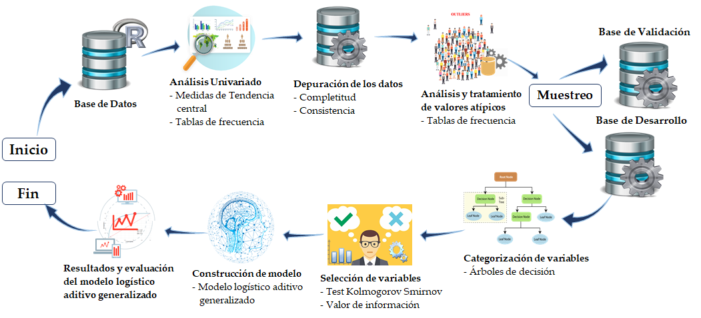

```{r share-again, echo=FALSE}
options(htmltools.dir.version = FALSE, htmltools.preserve.raw = FALSE)
#xaringanExtra::use_share_again()
xaringanExtra::use_fit_screen()
xaringanExtra::use_panelset()
```


class: clear, inverse, mline, center, middle

# Implementación y Resultados

---

layout: true

<div class="footer"><span> 
  <div class="row">
  <div class="content1"> Jaime Andrés Suquillo Llumiquinga - EPN </div> 
  <div class="content1"> Proyecto de Investigación </div> 
  <div class="content1"> Diciembre 17, 2021 </div> 
  </div>
</span></div>      


---

class: slides-demo

#  Implementación del Algoritmo

<div class="txt1" style = "margin-top: 35px; margin-bottom: 0px"> 
El algoritmo fue implementado por completo en el software estadístico <b>R</b> con ayuda
de <b>RStudio</b> (Entorno de desarrollo integrado), el cual permite explotar al máximo la
capacidad que posee R en la ciencia de datos.
</div>

--
<div class="txt1" style = "margin-top: 20px; margin-bottom: 0px"> 
En el siguiente flujograma se describen los pasos principales de la <b>Metodología Analítica</b> que forman parte del algoritmo:
</div>

--



---

class: slides-demo

#  Implementación del Algoritmo


<h3 style = "margin-bottom: 25px" > Análisis exploratorio y tratamiento de datos </h3>

<div class="txt1" style = "margin-top: -10px; margin-bottom: -15px"> 
Los primeros pasos a ejecutarse corresponden a los relacionados al análisis exploratorio de los datos y tratamiento de los mismos.
</div>

--
<h4 style = "margin-bottom: 0px" > <b>Análisis Univariado</b> </h4>  

<div class="txt1" style = "margin-top: 10px; margin-bottom: -15px"> 
Análisis Univariado o Estadística Descriptiva de cada una de las variables explicativas. 
</div>

--

* **Medidas de tendencia central, posicionamiento y dispersión:** Para las variables cuantitativas.

--
* **Tablas de frecuencia:** Para las variables cualitativas.

--

<h4 style = "margin-bottom: 0px; margin-top: -10px;" >  <b>Depuración de los datos</b> </h4>  

<div class="txt1" style = "margin-top: 10px; margin-bottom: -5px"> 
Luego de la exploración de los datos corresponde realizar su tratamiento, comenzando con la depuración de los mismos. Se procede como sigue:
</div>

--

* **Completitud:** En este paso el algoritmo imputa los valores perdidos.

--
* **Consistencia:** Se corrige las variables que no cumplan con su regla semántica.

--
* **Variables constantes:** En caso de existir variables constantes se las elimina.

---

class: slides-demo

#  Implementación del Algoritmo

<h3 style = "margin-bottom: 25px" > Análisis exploratorio y tratamiento de datos </h3>

<h4 style = "margin-bottom: 0px; margin-top: 20px;" > <b>Análisis y tratamiento de valores atípicos</b> </h4>  

<div class="txt1" style = "margin-top: 10px; margin-bottom: -5px"> 
Lo que sigue es realizar el análisis y tratamiento de valores atípicos:
</div>

--

* A las variables numéricas seleccionadas se les realiza un estudio, analizando y tratando todos los valores atípicos que se encuentren.

--
* Se tratan los valores atípicos mediante el método conocido como **Winsorización**.

--

<div class="txt1" style = "margin-top: 10px; margin-bottom: -5px"> 
Se hace uso de la Winsorización del `90 \%`.
</div>


---

class: slides-demo

#  Implementación del Algoritmo

<h3 style = "margin-bottom: 25px" > Selección de Muestras: Desarrollo y Validación </h3>

<div class="txt1" style = "margin-top: 10px; margin-bottom: -5px"> 
dividir la muestra total seleccionada en el mes de observación en dos submuestras: muestra de desarrollo y validación con la proporción `(70\%`/`30\%)`,
</div>

--

<h3 style = "margin-bottom: 25px" > Categorización de variables </h3>

Esta categorización se realiza mediante árboles de decisión con grupos de al menos el $5 \%$ de observaciones de la muestra total en cada nodo, el algoritmo categoriza:

--

* Variables cualitativas que posean $5$ o más categorías. 

--
* Variables cuantitativas que posean un valor cuya frecuencia relativa sea mayor o igual al $20 \%$. 

---

class: slides-demo

#  Implementación del Algoritmo

<h3 style = "margin-bottom: 15px" > Selección de variables </h3>

<div class="txt1" style = "margin-top: 10px; margin-bottom: -5px"> 
En este paso el algoritmo realiza la selección de variables explicativas empleando las siguientes metodologías.
</div>

--

* **Medidas de separación:** Se calcula el valor de la prueba de Kolmogórov-Smirnov (Test KS) para cada una de las variables cuantitativas.

--
* **Medidas de asociación:** Se calcula el valor de información (VI) para cada una de las variables cualitativas.

--

<h3 style = "margin-bottom: 15px; margin-top: 25px;" > Construcción del modelo logístico aditivo generalizado </h3>

<div class="txt1" style = "margin-top: 20px; margin-bottom: 0px"> 
El modelo logístico aditivo generalizado óptimo se lo construye suavizando las variables explicativas cuantitativas mediante <b>splines cúbicos de regresión</b> y el número de nodos adecuado.
</div>

--

<div class="txt1" style = "margin-top: 15px; margin-bottom: -5px"> 
Para poder implementar el modelo se hace uso de la librería <b>'mgcv'</b> del Software estadístico <b>R</b>, que permite estimar explícitamente los coeficientes para cada término suave mediante PIRLS (con estimación de suavidad integrada). 
</div>


---

class: slides-demo

#  Resultados

<h3 style = "margin-bottom: 15px" > Resultados y evaluación del modelo </h3>

<div class="txt1" style = "margin-top: 10px; margin-bottom: -5px"> 
El algoritmo calcula los estadísticos: AUC, KS y coeficiente de GINI (Medidas de discriminación), la matriz de confusión y la tabla de desempeño.
</div>

--

* Estas técnicas estadísticas nos ayudan a evaluar la capacidad predictiva y de discriminación del modelo.


--
[Resultados del modelo](https://andres13mh.shinyapps.io/ModeloGAM/)
